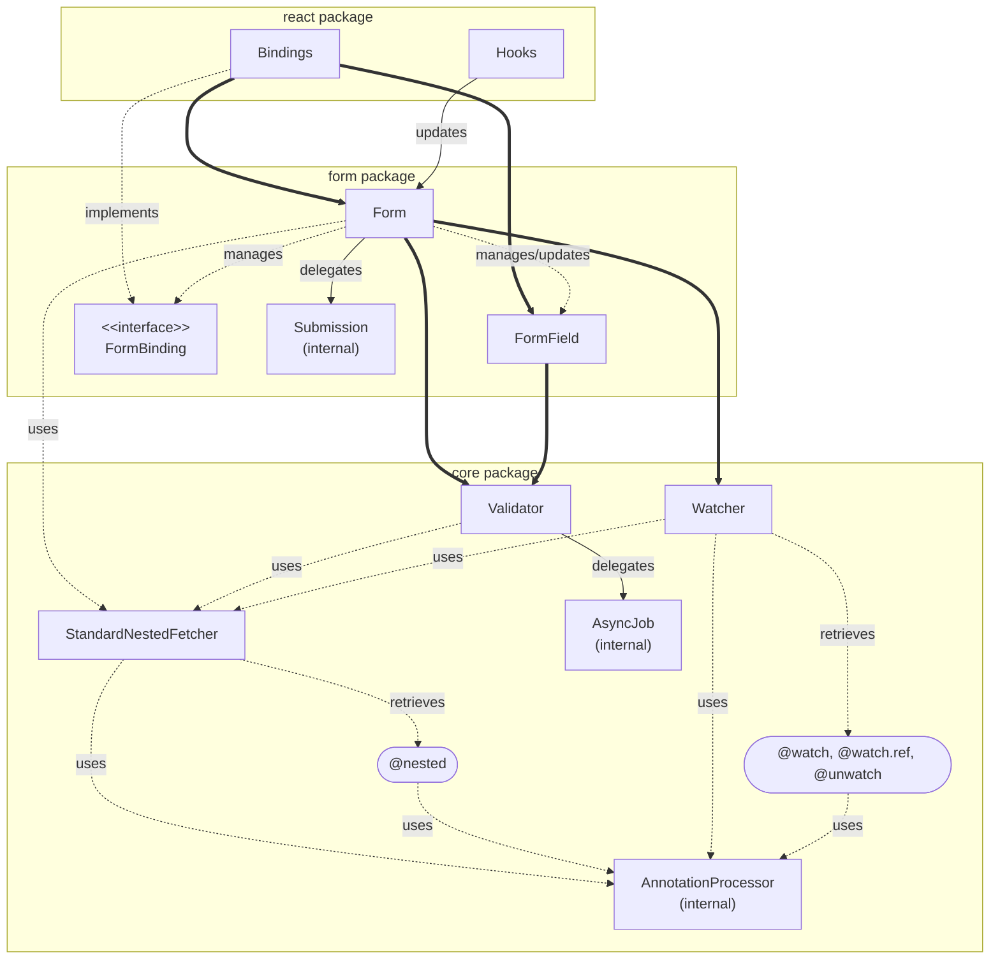

# mobx-sentinel

[](https://github.com/creasty/mobx-sentinel/actions/workflows/push.yml)
[](https://codecov.io/gh/creasty/mobx-sentinel)
[](https://opensource.org/licenses/MIT)

> [!CAUTION]
> This library is currently in the early stage of development. User interface is subject to change without notice.

MobX library for non-intrusive class-based model enhancement. Acting as a sentinel, it provides change detection, reactive validation, and form integration capabilities without contamination.

## Motivation

This library originally started with the goal of creating a form-building library centered around models, and evolved into a more general-purpose library that enhances model capabilities with form management being one of its applications.

### About Form Management

When dealing with complex domains, we needed a solution that works with forms while assuming business logic exists as class implementations using MobX. With models as a premise, most responsibilities should be placed on the model side.

While there are already many libraries for building forms using MobX, they are all designed from a data serialization perspective rather than modeling, and have issues either being unable to use classes or not properly separating data from form state management. Furthermore, there isn't a single one designed to allow type-safe implementation from both model and UI ends. (cf. [Alternatives](#alternatives)) \
Additionally, showing error messages to users at appropriate times is important for user experience, yet many existing libraries lack proper design.

This library aims to solve these problems through a model-centric design that properly separates and breaks down responsibilities into layers:

- Validation = Business logic layer (Model)
  - Provides validity state and error management
- Form-specific state management = Application logic layer (View-Model)
  - Handles form submission
  - Reacts to validity state changes
- Input element connection (a.k.a. Binding) = Presentation layer (View)
  - Handles form state and UI events to update forms, models and UI
  - Gets values from the model and writes back on input changes
  - Expresses error states

## Overview

[apps/example/](./apps/example) is deployed at [example.mobx-sentinel.creasty.com](https://example.mobx-sentinel.creasty.com).

### Model

```typescript
import { action, observable, makeObservable } from "mobx";
import { nested, makeValidatable } from "@mobx-sentinel/core";

export class Sample {
  @observable name: string = "";
  @observable confirmed: boolean = false;

  // Nested/dynamic models can be tracked with @nested annotation
  @nested @observable nested = new Other();
  @nested @observable items = [new Other()];

  constructor() {
    makeObservable(this);

    // 'Reactive validation' is implemented here
    makeValidatable(this, (b) => {
      if (!this.name.trim()) b.invalidate("name", "Name is required");
      if (this.name.length > 50) b.invalidate("name", "Name is too long");
      if (this.confirmed === false) b.invalidate("confirmed", "Confirmation is required");
      if (this.items.length === 0) b.invalidate("items", "Select at least one item");
    });
  }

  @action.bound
  addNewItem() {
    this.items.push(new Other());
  }
}
```

```typescript
const model = new Sample();
const watcher = Watcher.get(model);
const validator = Validator.get(model);

// Do something with the model...
runInAction(() => {
  model.name = "hello";
  model.nested.title = "world";
});

// Check if the model has changed
watcher.changed //=> true
watcher.changedKeyPaths //=> Set ["name", "nested.title"]

// Check if the model is valid
await when(() => !validator.isValidating);
validator.isValid //=> false
validator.invalidKeyPaths //=> Set ["confirmed", ..., "items.0.title"]
```

### Form

```tsx
import "@mobx-sentinel/react/dist/extension";

import { observer } from "mobx-react-lite";
import { Form } from "@mobx-sentinel/form";
import { useFormHandler } from "@mobx-sentinel/react";

const SampleForm: React.FC<{ model: Sample }> = observer(({ model }) => {
  // Get the form instance for the model.
  const form = Form.get(model);

  // Form submission logic is implemented here.
  // When you have view-models, form.addHandler() API is also available.
  useFormHandler(form, "submit", async (abortSignal) => {
    // Serialize the model and send it to a server...
    return true;
  });

  return (
    <>
      <div className="field">
        {/* Binding adds proper aria- attributes */}
        <label {...form.bindLabel(["name", "confirmed"])}>Inputs</label>
        <input
         {...form.bindInput("name", {
            getter: () => model.name, // Get the value from the model.
            setter: (v) => (model.name = v), // Write the value to the model.
          })}
        />
        {/* Displays error messages when appropriate */}
        <ErrorText errors={form.getErrors("name")} />
        <input
          {...form.bindCheckBox("confirmed", {
            getter: () => model.confirmed,
            setter: (v) => (model.confirmed = v),
          })}
        />
        <ErrorText errors={form.getErrors("confirmed")} />
      </div>

      <div className="field">
        <h4>Nested form</h4>
        {/* No need to pass the parent form instance to the sub-form. */}
        <OtherForm model={model.nested} />
      </div>

      <div className="field">
        <h4>Dynamic form</h4>
        <ErrorText errors={form.getErrors("items")} />

        {model.items.map((item, i) => (
          <OtherForm key={i} model={item} />
        ))}

        {/* Add a new form by mutating the model directly. */}
        <button onClick={model.addNewItem}>Add a new form</button>
      </div>

      <button {...form.bindSubmitButton()}>Submit</button>
    </>
  );
});
```

```tsx
const OtherForm: React.FC<{ model: Other }> = observer(({ model }) => {
  // Forms are completely independent. No child-to-parent dependency
  const form = Form.get(model);

  return (...);
});
```

## Packages

Detailed documentation is available in the respective package directory.

### `core` — Core functionality like Watcher and Validator [(read more)](./packages/core/README.md)

<pre><code>npm install --save <b>@mobx-sentinel/core</b></code></pre>

[](https://www.npmjs.com/package/@mobx-sentinel/core)
[](https://bundlephobia.com/package/@mobx-sentinel/core)


- `@nested` annotation for tracking nested models.
  - `@nested` annotation supports objects, boxed observables, arrays, sets, and maps.
  - `@nested.hoist` annotation can be used to hoist sub-fields in a nested model to the parent model.
  - `StandardNestedFetcher` (low-level API) provides a simple but powerful mechanism for tracking and retrieving nested models. Allowing other modules (even your own code) to integrate nested models into their logic without hassle.
- `Watcher` detects changes in models automatically.
  - All `@observable` and `@computed` annotations are automatically watched by default.
  - `@watch` annotation can be used where `@observable` is not applicable.<br>
    e.g., on private fields: `@watch #private = observable.box(0)`
  - `@watch.ref` annotation can be used to watch values with identity comparison, in contrast to the default behavior which uses shallow comparison.
  - `@unwatch` annotation and `unwatch(() => ...)` function disable change detection when you need to modify values silently.
- `Validator` and `makeValidatable` provides reactive model validation.
  - Composable from multiple sources.
  - Both sync and async validations are supported.
  - Async validations feature smart job scheduling and are cancellable with [AbortSignal](https://developer.mozilla.org/en-US/docs/Web/API/AbortSignal).

### `form` — Form and bindings [(read more)](./packages/form/README.md)

<pre><code>npm install --save <b>@mobx-sentinel/form</b></code></pre>

[](https://www.npmjs.com/package/@mobx-sentinel/form)
[](https://bundlephobia.com/package/@mobx-sentinel/form)


- Asynchronous submission
  - Composable from multiple sources.
  - Cancellable with [AbortSignal](https://developer.mozilla.org/en-US/docs/Web/API/AbortSignal).
- Nested and dynamic (array) forms
  - Works by mutating models directly.
  - Forms are created independently; they don't need to be aware of each other.
- Custom bindings
  - Flexible and easy-to-create.
  - Most cases can be implemented in less than 50 lines.
- Smart error reporting
  - Original validation strategy for a supreme user experience.

### `react` — Standard bindings and hooks for React [(read more)](./packages/react/README.md)

<pre><code>npm install --save <b>@mobx-sentinel/react</b></code></pre>

[](https://www.npmjs.com/package/@mobx-sentinel/react)
[](https://bundlephobia.com/package/@mobx-sentinel/react)


- React hooks that automatically handle component lifecycle under the hood.
- Standard bindings for most common form elements.

## Design Principles

- Model first
  - Assumes the existence of class-based models.
  - Promotes clear separation between core business logic and application logic.
  - [Form] Pushes responsibilities towards the model side, minimizing form responsibilities.
  - [Form] Do not manage data directly; Not intended for simple data-first form implementations.
- Non-intrusive
  - Minimizes required interfaces for models, maintaining purity.
  - Extends model's capabilities from an "outsider" standpoint.
  - [Form] No direct references between forms and models.
- Transparent I/O
  - No module directly mutates models — Makes control obvious and safe.
  - Unidirectional data flow / dependency.
  - [Form] No hidden magic between model ↔ input element interactions.
- Modular implementation
  - Multi-package architecture with clear separation of concerns.
  - Enhances testability and extensibility.
- Rigorous typing
  - Maximizes use of TypeScript's type system for error detection and code completion.
  - Improves development productivity.

## Architecture

- `┈┈` Dashed lines indicate non-reactive relationships.
- `──` Solid lines indicate reactive relationships.
- `━━` Heavy lines indicate main reactive relationships.

Key points:

- Watcher and Validator observe your model, and Form and FormField utilize them.
- Form has no reactive dependencies on FormField/FormBinding.
- State synchronization is only broadcast from Form to FormField (and Watcher).



## Milestones

Check out https://github.com/creasty/mobx-sentinel/milestones

## Alternatives

### Form management

Criteria:
[**T**] Type-safe interfaces.
[**B**] Binding for UI.
[**C**] Class-based implementation.

[img-ts]: https://cdn.simpleicons.org/typescript/3178c6?size=16
[img-js]: https://cdn.simpleicons.org/javascript/f7df1e?size=16

<!-- prettier-ignore-start -->

| Repository | Stars | Tests | T | B | C |
|------------|-------|-------|---|---|---|
| ![TypeScript][img-ts] [mobx-react-form](https://github.com/foxhound87/mobx-react-form) |  | [](https://codecov.io/gh/foxhound87/mobx-react-form) | | ✓ | |
| ![TypeScript][img-ts] [formstate](https://github.com/formstate/formstate) |  | Adequate | ✓ | | |
| ![TypeScript][img-ts] [formst](https://github.com/formstjs/formst) |  | N/A | | ✓ | |
| ![TypeScript][img-ts] [smashing-form](https://github.com/eyedea-io/smashing-form) |  | Sparse | | ✓ | |
| ![TypeScript][img-ts] [formstate-x](https://github.com/qiniu/formstate-x) |  | [](https://coveralls.io/github/qiniu/formstate-x?branch=master) | ✓ | | |
| ![JavaScript][img-js] [mobx-form-validate](https://github.com/tdzl2003/mobx-form-validate) |  | N/A | | | ✓ |
| ![JavaScript][img-js] [mobx-form](https://github.com/kentik/mobx-form) |  | N/A | | ✓ | |
| ![JavaScript][img-js] [mobx-schema-form](https://github.com/alexhisen/mobx-schema-form) |  | Sparse | | | |
| ![TypeScript][img-ts] [mobx-form-schema](https://github.com/Yoskutik/mobx-form-schema) |  |  | | | ✓ |
| ![JavaScript][img-js] [mobx-form-store](https://github.com/alexhisen/mobx-form-store) |  | Adequate | | | |
| ![TypeScript][img-ts] [mobx-form-reactions](https://github.com/marvinhagemeister/mobx-form-reactions) |  | N/A | | | |
| ...and many more | <10 | | | | | |

<!-- prettier-ignore-end -->
