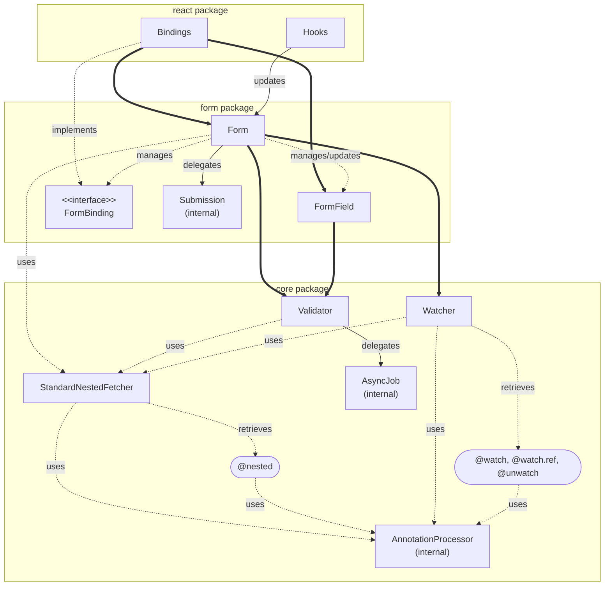

# mobx-sentinel

[](https://github.com/creasty/mobx-sentinel/actions/workflows/push.yml)
[](https://codecov.io/gh/creasty/mobx-sentinel)
[](https://opensource.org/licenses/MIT)

> [!CAUTION]
> This library is currently in the early stage of development. User interface is subject to change without notice.

MobX library for non-intrusive class-based model enhancement. Acting as a sentinel, it provides change detection, reactive validation, and form integration capabilities without contamination.

## Motivation

This library originally started with the goal of creating a form-building library centered around models, and evolved into a more general-purpose library that enhances model capabilities with form management being one of its applications.

### About Form Management

When dealing with complex domains, we needed a solution that works with forms while assuming business logic exists as class implementations using MobX. With models as a premise, most responsibilities should be placed on the model side.

While there are already many libraries for building forms using MobX, they are all designed from a data serialization perspective rather than modeling, and have issues either being unable to use classes or not properly separating data from form state management. Furthermore, there isn't a single one designed to allow type-safe implementation from both model and UI ends. (cf. [Alternatives](#alternatives)) \
Additionally, showing error messages to users at appropriate times is important for user experience, yet many existing libraries lack proper design. (cf. [Smart Error Reporting](./packages/form/README.md#smart-error-reporting))

This library aims to solve these problems through a model-centric design that properly separates and breaks down responsibilities into layers:

- Validation = Business logic layer (Model)
  - Provides validity state and error management
- Form-specific state management = Application logic layer (View-Model)
  - Handles form submission
  - Reacts to validity state changes
- Input element connection (a.k.a. Binding) = Presentation layer (View)
  - Handles form state and UI events to update forms, models and UI
  - Gets values from the model and writes back on input changes
  - Expresses error states

## Overview

[apps/example/](./apps/example) is a working invoice editor — cross-field rules, a throttled CRM lookup, nested and repeated sub-forms, server-reported conflicts, dirty tracking and autosave. It is deployed at [example.mobx-sentinel.creasty.com](https://example.mobx-sentinel.creasty.com). The code below is condensed from it.

### Model

Your model stays a model: plain MobX classes that own the data, the derived values and the rules. The library adds two things — an annotation that lets it see through to nested objects, and validation handlers declared next to the data they constrain.

```typescript
import { action, computed, makeObservable, observable } from "mobx";
import { makeValidatable, nested, unwatch } from "@mobx-sentinel/core";

export class Invoice {
  @observable customerEmail = "";
  @observable issuedOn = startOfToday();
  @observable paymentTerms: PaymentTerms = "NET_30";
  @observable customDueOn: Date | null = null;

  // Nested and dynamic models are tracked through the `@nested` annotation.
  // Objects, arrays, sets, maps and boxed observables all work.
  @nested @observable billTo = new PostalAddress();
  @nested @observable lineItems = [new LineItem()];

  constructor() {
    makeObservable(this);

    // 'Reactive validation' is implemented here.
    makeValidatable(this, (b) => {
      if (!EMAIL_PATTERN.test(this.customerEmail)) {
        b.invalidate("customerEmail", "Enter a valid email address");
      }
      // Cross-field rules are ordinary code — no resolver, no schema gymnastics.
      if (this.paymentTerms === "CUSTOM" && this.customDueOn && this.customDueOn < this.issuedOn) {
        b.invalidate("customDueOn", "The due date cannot precede the issue date");
      }
      // And rules that span the children belong to the parent, where they can see all of them.
      if (this.total <= 0) {
        b.invalidate("lineItems", "The invoice total must be greater than zero");
      }
    });

    // Asynchronous rules compose on top of the synchronous ones.
    // The Validator throttles the calls; a keystroke made while a request is in
    // flight is checked after that request settles. The signal is aborted when
    // the validator is reset or the handler is removed.
    makeValidatable(
      this,
      () => this.customerEmail,
      async (email, b, abortSignal) => {
        const response = await fetch(`/api/customers/${email}`, { signal: abortSignal });
        if (!response.ok) {
          b.invalidate("customerEmail", "No customer in the CRM uses this address");
        }
      },
      { initialRun: false }
    );
  }

  // Derived amounts are business logic, not form state.
  // `@unwatch` keeps them out of change detection, so the change report below
  // shows what the user edited rather than everything that recomputed.
  @unwatch
  @computed
  get total(): number {
    return this.lineItems.reduce((sum, item) => sum + item.amount * (1 + item.taxRate), 0);
  }

  @action.bound
  addLineItem() {
    this.lineItems.push(new LineItem());
  }
}
```

### Change detection and validation

Both are available on any model, with or without a form — which is what makes them usable for autosave, sync, navigation guards and server round-trips.

```typescript
import { reaction, runInAction, when } from "mobx";
import { unwatch, Validator, Watcher } from "@mobx-sentinel/core";

const invoice = new Invoice();
const watcher = Watcher.get(invoice);
const validator = Validator.get(invoice);

runInAction(() => {
  invoice.customerEmail = "ap@northwind.example";
  invoice.lineItems[0].quantity = 3;
});

// What changed — through nested models and arrays alike.
watcher.changed //=> true
watcher.changedKeyPaths //=> Set ["customerEmail", "lineItems.0.quantity"]

// What is wrong — aggregated from every nested validator.
await when(() => !validator.isValidating);
validator.isValid //=> false
validator.invalidKeyPaths //=> Set ["billTo.postalCode", "lineItems.0.unitPrice"]
validator.firstErrorMessage //=> "ZIP code is required"

// `changedTick` is the hook an autosave, an undo stack or a sync loop needs.
reaction(
  () => watcher.changedTick,
  () => saveDraft(invoice)
);

// ...and `unwatch()` is how you write to the model without it counting as an edit.
unwatch(() => invoice.restoreDraft(draft));
watcher.changed //=> false — the invoice is populated, the form is still pristine
```

### Form

The form layer is the last mile: it knows when to show an error, when the submit button may be pressed, and how to attach a value to an input. It holds no data of its own.

```tsx
import "@mobx-sentinel/react/dist/extension";

import { observer } from "mobx-react-lite";
import { Form } from "@mobx-sentinel/form";
import { useFormHandler } from "@mobx-sentinel/react";

const InvoiceForm: React.FC<{ model: Invoice }> = observer(({ model }) => {
  // One line to attach a form to a model.
  // No provider, no context, no schema, no field registration.
  const form = Form.get(model);

  // Submission is a lifecycle rather than a callback: `willSubmit` can veto it,
  // `submit` handlers run serially with an AbortSignal and report whether the submission succeeded,
  // `didSubmit` reacts to the outcome.
  // When you have view-models, form.addHandler() API is also available.
  useFormHandler(form, "submit", async (abortSignal) => {
    const response = await fetch("/api/invoices", {
      method: "POST",
      body: JSON.stringify(model),
      signal: abortSignal, // Cancels the request when a newer submission replaces this one.
    });
    return response.ok; // didSubmit receives this, and the form resets itself only on true.
  });

  return (
    <>
      <div className="field">
        {/* Bindings add the proper aria- attributes and tie the label to the input. */}
        <label {...form.bindLabel(["customerEmail"])}>Billing contact</label>
        <input
          {...form.bindInput("customerEmail", {
            getter: () => model.customerEmail, // Get the value from the model.
            setter: (v) => (model.customerEmail = v), // Write the value to the model.
          })}
        />
        {/* Errors appear when the user is ready for them, not on the first keystroke. */}
        <ErrorText errors={form.getErrors("customerEmail")} />
      </div>

      {/* A nested model gets its own form. Nothing is threaded down from the parent. */}
      <AddressForm model={model.billTo} />

      {/* A dynamic list is just an array on the model: mutate it and the forms follow. */}
      {model.lineItems.map((item) => (
        <LineItemForm key={item.id} model={item} />
      ))}
      <button onClick={model.addLineItem}>Add a line</button>

      {/* Disabled while the form is invalid, pristine or busy.
          Hovering it reveals every outstanding error at once. */}
      <button {...form.bindSubmitButton()}>Send invoice</button>
    </>
  );
});
```

```tsx
const AddressForm: React.FC<{ model: PostalAddress }> = observer(({ model }) => {
  // Forms are looked up per model and are completely independent.
  // No child-to-parent dependency, yet the parent's validity and dirtiness include this one.
  const form = Form.get(model);

  return (...);
});
```

## Packages

Detailed documentation is available in the respective package directory.

### `core` — Core functionality like Watcher and Validator [(read more)](./packages/core/README.md)

<pre><code>npm install --save <b>@mobx-sentinel/core</b></code></pre>

[](https://www.npmjs.com/package/@mobx-sentinel/core)
[](https://bundlephobia.com/package/@mobx-sentinel/core)


- `@nested` annotation for tracking nested models.
  - `@nested` annotation supports objects, boxed observables, arrays, sets, and maps.
  - `@nested.hoist` annotation can be used to hoist sub-fields in a nested model to the parent model.
  - `StandardNestedFetcher` (low-level API) provides a simple but powerful mechanism for tracking and retrieving nested models. Allowing other modules (even your own code) to integrate nested models into their logic without hassle.
- `Watcher` detects changes in models automatically.
  - All `@observable` and `@computed` annotations are automatically watched by default.
  - `@watch` annotation can be used where `@observable` is not applicable.<br>
    e.g., on private fields: `@watch #private = observable.box(0)`
  - `@watch.ref` annotation can be used to watch values with identity comparison, in contrast to the default behavior which uses shallow comparison.
  - `@unwatch` annotation and `unwatch(() => ...)` function disable change detection when you need to modify values silently.
- `Validator` and `makeValidatable` provides reactive model validation.
  - Composable from multiple sources.
  - Both sync and async validations are supported.
  - Async validations feature smart job scheduling and are cancellable with [AbortSignal](https://developer.mozilla.org/en-US/docs/Web/API/AbortSignal).

### `form` — Form and bindings [(read more)](./packages/form/README.md)

<pre><code>npm install --save <b>@mobx-sentinel/form</b></code></pre>

[](https://www.npmjs.com/package/@mobx-sentinel/form)
[](https://bundlephobia.com/package/@mobx-sentinel/form)


- Asynchronous submission
  - Composable from multiple sources.
  - Cancellable with [AbortSignal](https://developer.mozilla.org/en-US/docs/Web/API/AbortSignal).
- Nested and dynamic (array) forms
  - Works by mutating models directly.
  - Forms are created independently; they don't need to be aware of each other.
- Custom bindings
  - Flexible and easy-to-create.
  - Most cases can be implemented in less than 50 lines.
- Smart error reporting [(read more)](./packages/form/README.md#smart-error-reporting)
  - Validation is always up to date; reporting decides when users see the errors.
  - Errors wait until the user leaves a field or pauses typing, then follow every fix.
  - Fields and sub-forms that appear later start clean, even after the whole form has been reported.

### `react` — Standard bindings and hooks for React [(read more)](./packages/react/README.md)

<pre><code>npm install --save <b>@mobx-sentinel/react</b></code></pre>

[](https://www.npmjs.com/package/@mobx-sentinel/react)
[](https://bundlephobia.com/package/@mobx-sentinel/react)


- React hooks that automatically handle component lifecycle under the hood.
- Standard bindings for most common form elements.

## Design Principles

- Model first
  - Assumes the existence of class-based models.
  - Promotes clear separation between core business logic and application logic.
  - [Form] Pushes responsibilities towards the model side, minimizing form responsibilities.
  - [Form] Do not manage data directly; Not intended for simple data-first form implementations.
- Non-intrusive
  - Minimizes required interfaces for models, maintaining purity.
  - Extends model's capabilities from an "outsider" standpoint.
  - [Form] No direct references between forms and models.
- Transparent I/O
  - No module directly mutates models — Makes control obvious and safe.
  - Unidirectional data flow / dependency.
  - [Form] No hidden magic between model ↔ input element interactions.
- Modular implementation
  - Multi-package architecture with clear separation of concerns.
  - Enhances testability and extensibility.
- Rigorous typing
  - Maximizes use of TypeScript's type system for error detection and code completion.
  - Improves development productivity.

## Architecture

- `┈┈` Dashed lines indicate non-reactive relationships.
- `──` Solid lines indicate reactive relationships.
- `━━` Heavy lines indicate main reactive relationships.

Key points:

- Watcher and Validator observe your model, and Form and FormField utilize them.
- Form has no reactive dependencies on FormField/FormBinding.
- State synchronization is only broadcast from Form to FormField (and Watcher).


```mermaid
graph TB

%%subgraph external
%%  Object((Object))
%%end

subgraph core package
  nested(["@nested"])
  StandardNestedFetcher -.-> |retrieves| nested
  %%StandardNestedFetcher -.-> |reads| Object

  watch(["@watch, @watch.ref, @unwatch"])
  Watcher -.-> |retrieves| watch
  Watcher -.-> |uses| StandardNestedFetcher
  %%Watcher --> |observes| Object

  Validator
  Validator --> |delegates| AsyncJob["AsyncJob<br>(internal)"]
  Validator -.-> |uses| StandardNestedFetcher
  %%Validator --> |observes| Object

  watch & Watcher & nested & StandardNestedFetcher -.-> |uses| AnnotationProcessor["AnnotationProcessor<br>(internal)"]
end

subgraph form package
  Form -.-> |manages/updates| FormField
  Form -.-> |manages| FormBinding["&lt;&lt;interface&gt;&gt;<br>FormBinding"]
  %%FormBinding -.-> |references| Form & FormField
  Form ==> Watcher
  FormField & Form  ==> Validator
  Form -.-> |uses| StandardNestedFetcher
  Form --> |delegates| Submission["Submission<br>(internal)"]
end

subgraph react package
  Hooks --> |updates| Form

  Bindings -.-> |implements| FormBinding
  Bindings ==> Form & FormField
end
```

## Milestones

Check out https://github.com/creasty/mobx-sentinel/milestones

## Alternatives

### Form management

For how error reporting compares with these and with other popular form libraries, see [How It Differs from Other Libraries](./packages/form/README.md#how-it-differs-from-other-libraries).

Criteria:
[**T**] Type-safe interfaces.
[**B**] Binding for UI.
[**C**] Class-based implementation.

[img-ts]: https://cdn.simpleicons.org/typescript/3178c6?size=16
[img-js]: https://cdn.simpleicons.org/javascript/f7df1e?size=16

<!-- prettier-ignore-start -->

| Repository | Stars | Tests | T | B | C |
|------------|-------|-------|---|---|---|
| ![TypeScript][img-ts] [mobx-react-form](https://github.com/foxhound87/mobx-react-form) |  | [](https://codecov.io/gh/foxhound87/mobx-react-form) | | ✓ | |
| ![TypeScript][img-ts] [formstate](https://github.com/formstate/formstate) |  | Adequate | ✓ | | |
| ![TypeScript][img-ts] [formst](https://github.com/formstjs/formst) |  | N/A | | ✓ | |
| ![TypeScript][img-ts] [smashing-form](https://github.com/eyedea-io/smashing-form) |  | Sparse | | ✓ | |
| ![TypeScript][img-ts] [formstate-x](https://github.com/qiniu/formstate-x) |  | [](https://coveralls.io/github/qiniu/formstate-x?branch=master) | ✓ | | |
| ![JavaScript][img-js] [mobx-form-validate](https://github.com/tdzl2003/mobx-form-validate) |  | N/A | | | ✓ |
| ![JavaScript][img-js] [mobx-form](https://github.com/kentik/mobx-form) |  | N/A | | ✓ | |
| ![JavaScript][img-js] [mobx-schema-form](https://github.com/alexhisen/mobx-schema-form) |  | Sparse | | | |
| ![TypeScript][img-ts] [mobx-form-schema](https://github.com/Yoskutik/mobx-form-schema) |  |  | | | ✓ |
| ![JavaScript][img-js] [mobx-form-store](https://github.com/alexhisen/mobx-form-store) |  | Adequate | | | |
| ![TypeScript][img-ts] [mobx-form-reactions](https://github.com/marvinhagemeister/mobx-form-reactions) |  | N/A | | | |
| ...and many more | <10 | | | | | |

<!-- prettier-ignore-end -->
