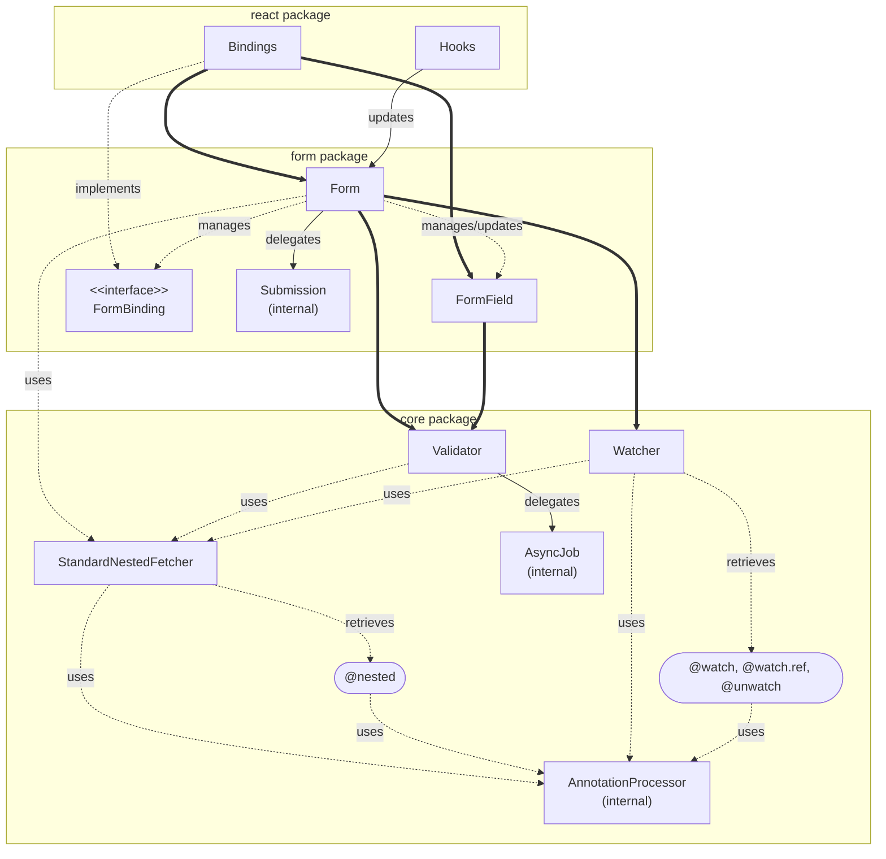

- `┈┈` Dashed lines indicate non-reactive relationships.
- `──` Solid lines indicate reactive relationships.
- `━━` Heavy lines indicate main reactive relationships.

Key points:

- Watcher and Validator observe your model, and Form and FormField utilize them.
- Form has no reactive dependencies on FormField/FormBinding.
- State synchronization is only broadcast from Form to FormField (and Watcher).

