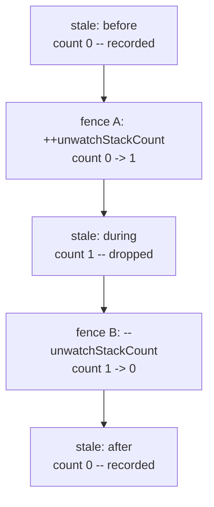
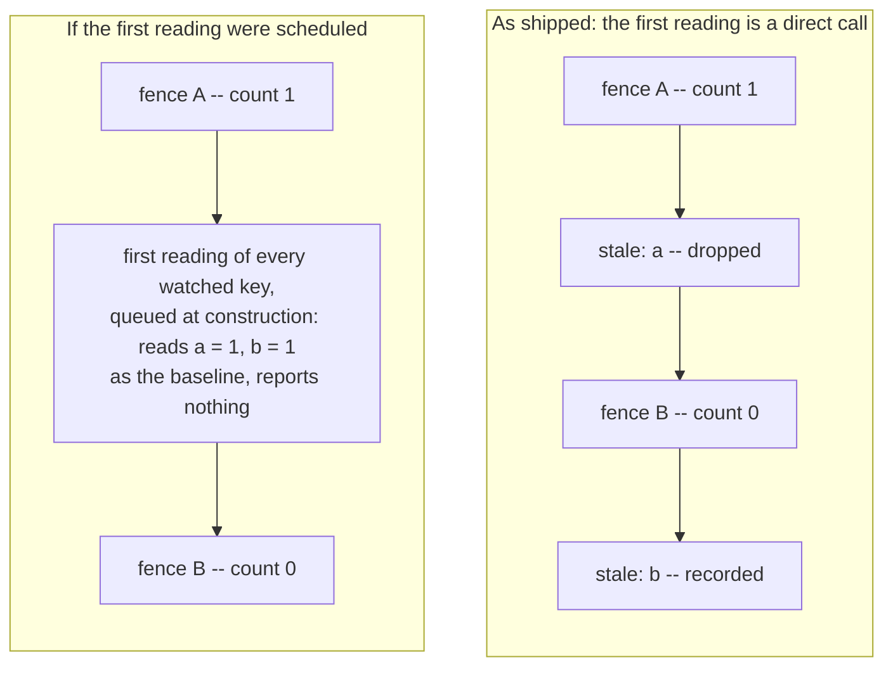

# Change Detection and Transactions

`packages/core/src/watcher.ts` contains two pieces of machinery that exist for one reason: MobX runs
reactions when a batch ends, not when a change is made. A `Watcher` is told about a change after the
fact, and both ends of that delay need work -- the reading a watcher takes when it is built, and the
judgement `unwatch()` has to make about changes that are no longer in front of it.

This note is for whoever edits that file next. What the machinery produces is described for users in
[Watching Changes](../../../apps/site/src/content/docs/docs/core/watching-changes.md); this is how it
is produced, and what breaks when you move a piece of it.

## The Bind

A write to an observable inside `runInAction()` or `transaction()` leaves its reactions stale without
running them: `runReactions()` returns immediately while `globalState.inBatch > 0`, and the queue is
drained when the outermost batch ends. Two problems follow, at opposite ends of the same deferral.

**The reading is late.** A watcher builds its reactions in its constructor, which may well run inside
a transaction -- `Watcher.get(model)` in the middle of an action, or a nested watcher reached while a
parent is being built. If the first reading is scheduled like any other run, it happens at the end of
that transaction, by which time the transaction's own changes are in the value it reads. They become
the baseline and are never reported.

**The effect is late.** `unwatch(fn)` promises that what `fn` changes goes undetected while whatever
happens around it is detected as usual. By the time the reactions run, `fn` has long returned, and
MobX exposes nothing that says which reaction went stale during that call. A flag raised and lowered
around `fn` answers the question for synchronous callers only, and the reactions are not those.

`watchReaction` answers the first, `runInUnwatch` the second.

## The First Reading: `watchReaction`

`watchReaction` is MobX's own `reaction()` runner with the scheduling of the first run replaced.

```ts
function watchReaction<T>(expression: () => T, effect: (value: T) => void): void {
  let value: T;
  let tracked = false;
  // Named, rather than left to MobX: the name is optional only from mobx 6.13.4 on, and the library supports 6.11
  const reaction = new Reaction("Watcher", () => takeReading());

  function takeReading() {
    let changed = false;
    reaction.track(() => {
      // An expression is a derivation, not a place to change state, just as `reaction()` treats it
      const nextValue = _allowStateChanges(false, expression);
      changed = tracked && !Object.is(value, nextValue);
      value = nextValue;
    });
    // Outside track(), so that an expression that throws still leaves the reading behind it, as MobX does
    tracked = true;
    if (changed) effect(value);
  }

  takeReading();
}
```

Put `function reaction(` in `node_modules/.pnpm/mobx@6.16.1/node_modules/mobx/dist/mobx.cjs.development.js`
next to it. `reactionRunner` there is the same code: `r.track()` wrapped around
`allowStateChanges(false, ...)`, a `changed` flag compared against the value of the previous run, the
effect called only when it changed. MobX schedules that runner, behind a guard for an
already-aborted signal, and hands back a disposer:

```js
    if (!((_opts4 = opts) != null && (_opts4 = _opts4.signal) != null && _opts4.aborted)) {
      r.schedule_();
    }
    return r.getDisposer_((_opts5 = opts) == null ? void 0 : _opts5.signal);
```

where `watchReaction` ends with

```ts
  takeReading();
```

`schedule_()` pushes the reaction onto `globalState.pendingReactions` and calls `runReactions()`,
which returns without running anything while `inBatch > 0`. Calling the runner directly reads now.
Every run after the first is still MobX's: the reaction is a plain
`new Reaction("Watcher", () => takeReading())`, so MobX invalidates and schedules it as it would any
other reaction.

The defect being fixed is a late *reading*, not a late *effect*. Watching `model.value`, starting at
`0`:

| Step | With `r.schedule_()` | With a direct call |
| --- | --- | --- |
| `Watcher.get(model)`, inside `runInAction` | the first run is queued; nothing has been read, so the reaction observes nothing yet | the expression is read now: `value` is `0`, `tracked` is `true`, and the reaction observes the key |
| `model.value = 1`, same transaction | nothing is stale, because nothing is observed | the reaction goes stale and MobX queues it |
| the outermost transaction ends | the first run reads `1`; being the first, it reports nothing, so `1` is the baseline | the second run reads `1`, which differs from `0`, so the effect runs |
| result | `watcher.changed` is `false` | `watcher.changedKeys` is `Set(["value"])` |

The right-hand column is pinned by "tracks changes made later in the same transaction", under
`describe("creation inside a transaction")` in `packages/core/src/watcher.test.ts`.

### Two Options That Look Like the Fix

`fireImmediately` moves the first *effect*; the first reading stays scheduled. It is also backwards
for this use. The effect is `#didChange`, so firing it on the first run would report every watched
key as changed the moment the watcher was built.

`autorun` ends in `reaction.schedule_()` too, so its first run is late in exactly the same way --
which is the reason it is not used here. It is *not* that the effect would take a dependency on what
it writes: every effect wraps its writes in `runInAction`, and `runInAction` passes
`canRunAsDerivation = false`, so `_startAction` takes the `runAsAction` branch and calls
`untrackedStart()`. A read inside it never becomes a dependency. The expression/effect split matters
for other reasons -- an untracked effect is what keeps the two concerns apart -- but self-triggering
is not one of them.

### Why `tracked = true` Sits Outside `track()`

It mirrors MobX's `firstTime = false`, which is likewise assigned after `r.track()` returns rather
than inside the callback. `Reaction.track` does not rethrow what the derivation throws: it checks
`isCaughtException(result)` and calls `this.reportExceptionInDerivation_(result.cause)`, so the
statements after `track()` run either way. That holds while MobX's error boundaries are on, which is
the default: `trackDerivedFunction` only wraps the call in `try`/`catch` in the `else` branch of
`if (globalState.disableErrorBoundaries === true)`, and `reportExceptionInDerivation_` rethrows under
the same flag. A consumer running `configure({ disableErrorBoundaries: true })` gets the throw
propagated, and the flag placement stops mattering because nothing after `track()` runs at all.

That is what lets a throwing expression leave a reading behind. Inside the callback, the assignment
would be skipped whenever the expression throws -- as `value = nextValue` already is -- and the next
run would still believe it was the first, taking the recovered value as the baseline instead of
reporting it as a change. Moving the line inside turns the result of "a `@watch` `@computed` that
throws when the watcher is created is counted as changed once it recovers" from
`Set(["risky", "fail"])` into `Set(["fail"])`.

### What Is Left Out of `reaction()`

| Left out | Why that is safe |
| --- | --- |
| `fireImmediately` | fires the first *effect*, not the first reading, and would mark every watched key changed at construction |
| `scheduler`, `delay` | every run after the first wants MobX's default timing |
| `equals` | `Object.is` is already the default. MobX resolves `opts.equals \|\| comparer["default"]`, and `comparer.default` is `defaultComparer`, which calls `Object.is`. It is not `comparer.identity`, which is `===`; the two differ on `NaN` and `±0` |
| `onError`, `requiresObservable` | unused here |
| `oldValue` | the effect takes the new value only; nothing compares against the previous one |
| `action(name, effect)` | MobX wraps the effect in an action and this does not, which holds only because every effect here wraps its own writes in `runInAction`. Pinned by "mutates its state in actions, so observing a watcher causes no strict-mode warnings". Keep it true of any effect you add |
| the disposer | discarded: a watcher is never disposed, and lives as long as its target and everything it observes |

Not left out: the reaction's name. `new Reaction("Watcher", ...)` passes one because the parameter is
`name_: string` in mobx 6.11 and `name_: string | undefined` from 6.16, and the peer range is
`^6.11.0` (`pnpm-workspace.yaml`). Dropping it would type-check against the lockfile and fail only on
the `test (v6.11.0)` leg of the matrix in `.github/workflows/push.yml`.

## The Fence: `runInUnwatch`

```ts
/** Global state for controlling whether watching is enabled */
let unwatchStackCount = 0;
function runInUnwatch(action: () => void): void {
  transaction(() => {
    // The reactions of a Watcher run when the outermost transaction ends, so inside one the count has to go up and
    // down there as well, to tell what this function changed apart from what was changed around it. MobX runs the
    // reactions in the order they went stale, and an autorun created here takes the place of this moment in that
    // queue: everything MobX runs between these two autoruns went stale while the function was running.
    autorun(() => ++unwatchStackCount);
    ++unwatchStackCount;
    try {
      action();
    } finally {
      --unwatchStackCount;
      autorun(() => --unwatchStackCount);
    }
  });
}
```

`unwatchStackCount` is module-level state shared by every watcher, and `Watcher.isWatching` is
`unwatchStackCount === 0`. Four call sites consult it and return early when it is not zero:
`#didChange`, `#recordChange`, `#incrementChangedTick` and `assumeChanged`. A count below zero
suppresses just as much as a count above it, which is why each operation below is paired.

Two of the four operations govern the callback while it runs; the other two govern the flush that
happens later. The synchronous pair is pinned by `it("runs the function without changes being
detected by Watcher")` in `watcher.test.ts`, which calls `assumeChanged()` and `didChange("value")`
inside the callback and asserts neither reaches the watcher.

| Operation | Governs | What it is for |
| --- | --- | --- |
| `autorun(() => ++unwatchStackCount)` | the flush | takes the queue position of "the callback is about to start" and raises the count when the drain reaches it |
| `++unwatchStackCount` | the callback | makes `Watcher.isWatching` honest for anything consulted synchronously inside the callback -- `assumeChanged()` and `#didChange()` called directly, and the public `Watcher.isWatching` |
| `--unwatchStackCount` in `finally` | the callback | restores it the moment the callback returns or throws, so what happens around the call is unaffected |
| `autorun(() => --unwatchStackCount)` | the flush | takes the queue position of "the callback has returned" and lowers the count there |

The two autoruns are the timestamp MobX does not otherwise provide. A reaction enters
`globalState.pendingReactions` at the moment it goes stale, a newly created autorun enters it at the
moment it is created, and the queue drains in that order -- so a reaction that went stale while the
callback ran can only sit between the two, and one that went stale before or after cannot. Neither
autorun reads an observable, so each runs once and is never queued again.

For this transaction:

```ts
runInAction(() => {
  model.before = 1;
  unwatch(() => {
    model.during = 1;
  });
  model.after = 1;
});
```

the queue at the end of the outermost transaction is:



`watcher.changedKeys` is `Set(["before", "after"])`, pinned by "only drops what the `unwatch()`
function changes, not what is changed around it in the same transaction".

### What Breaks Without Each Piece

Measured by running that same transaction against a copy of `watcher.ts` with one piece removed:

| Variant | `changedKeys` | `unwatchStackCount` afterwards |
| --- | --- | --- |
| as shipped | `before`, `after` | `0` |
| without the opening autorun | `before`, **`during`** | `-1` |
| without the closing autorun | `before` | `1` |
| without the synchronous pair | `before`, `after` | `0` |
| without either autorun | `before`, `during`, `after` | `0` |

**Without the opening autorun**, the count is still zero when the drain reaches `during`, so the one
change `unwatch()` exists to hide is recorded. The closing autorun then lowers the count to `-1`,
which drops `after` and leaves every later change dropped too: the fences are inverted, suppressing
exactly what they should let through.

**Without the closing autorun**, the callback's change is suppressed and so is everything after it.
The count never comes back down, so `Watcher.isWatching` stays false for the rest of the process.

**Without the synchronous pair**, the fences still govern the queue, so a change made through an
observable is still suppressed -- but `Watcher.isWatching` reads true inside the callback, and
anything that consults it synchronously escapes: `unwatch(() => watcher.assumeChanged())` marks the
watcher changed.

**Without either autorun**, the synchronous pair is back to zero before the queue is drained, so
`unwatch()` suppresses nothing that a reaction reports. That is the whole point of the fence: inside
a transaction the count is not raised at any moment the watcher's reactions can see.

## What This Rests On

Two MobX behaviours that upstream does not document:

- pending reactions run in the order they went stale;
- an autorun created inside a batch takes its position in that order.

Both are pinned in `packages/core/src/mobx.test.ts`, under `describe("order of pending reactions")`:
"pending reactions run in the order they went stale, and an autorun created in a batch takes its
place in that order", and "a reaction made stale before a new autorun runs ahead of it, and one made
stale after runs behind it". The comment above them points back at `unwatch()`.

They are pinned because the packages support a MobX range, `^6.11.0`, and the CI matrix runs the
tests against both ends of it plus the lockfile. Undocumented behaviour can change in a patch release
without anything saying so; these two tests are how that arrives as a clear failure instead of as
`unwatch()` quietly keeping or dropping the wrong changes.

## How the Two Halves Interlock

The two are independent. Each fixes its own defect, each has its own tests, and removing one does not
disturb the other. They meet in one case: a watcher built *inside* an `unwatch()` callback.

```ts
runInAction(() => {
  unwatch(() => {
    watcher = Watcher.get(model); // built inside
    model.a = 1;                  // changed inside
  });
  model.b = 1;                    // changed after
});

watcher.changedKeys //=> Set(["b"])
```

That comes out right only because of how the halves fit together. `watchReaction` reads
synchronously, so the watcher's first reading happens inline, between the fences, against the state
as the callback finds it -- and each watched key comes out of it with a reaction that observes that
key. `model.a = 1` then makes one of them stale between the fences, where it is dropped, while
`model.b = 1` makes another stale behind fence B, where it is kept.

What makes this work is that the synchronous call puts nothing in the queue:



In the right-hand case there is no entry behind fence B at all. The readings were queued while the
callback ran, so they sit between the fences, and neither write reaches them: a reaction that has not
run yet observes nothing, so there is nothing for a write to invalidate. `changedKeys` comes out
empty. An `autorun`-based first reading lands in the same place, for the same reason.

No test pins this composite case today. The nearest are "tracks changes made after `unwatch()` ends
when created inside `unwatch()`", where the callback changes nothing, and "only drops what the
`unwatch()` function changes, not what is changed around it in the same transaction", where the
watcher already exists. If you touch either half, this is the case to check by hand.

## Two Residual Limitations

### The Bracket Is Synchronous

`runInUnwatch` opens and closes within one turn of the event loop, so it covers only the synchronous
part of its callback. An `async` callback returns a promise that `unwatch()` discards, and everything
after the first `await` runs outside the bracket and is detected as usual. Pinned by
`it("returns undefined for an async function, and changes after the first await are tracked")` in
`watcher.test.ts`.

### A Key the Callback Changes Stays Suppressed for the Batch

MobX queues a reaction once per batch. `Reaction.onBecomeStale_` calls `schedule_()`, which does
nothing when `isScheduled` is already set, and `isScheduled` is cleared in `runReaction_` -- that is,
when the reaction actually runs. A key the callback changes therefore takes its queue position
between the fences, and changing that same key again later in the same transaction does not move it:
it stays between the fences and stays suppressed.

```ts
runInAction(() => {
  unwatch(() => {
    model.value = 1; // queues the reaction, between the fences
  });
  model.value = 2; // already queued: does not move
  model.otherValue = 1;
});

watcher.changedKeys //=> Set(["otherValue"])
```

Pinned by "drops a key that `unwatch()` changes before it changes again in the same transaction",
which also covers the case outside a transaction, where the two changes are two batches and the
second is detected. The reverse order is detected as well, since the first change queues the reaction
ahead of fence A: "tracks a key that is changed both before and after `unwatch()` in the same
transaction".

This is a property of the queue position being the only timestamp available, not of the fence. Fixing
it needs a different signal than "where in the queue did this reaction go stale".

## Invariants

- `watchReaction` takes its first reading by calling the runner, not by scheduling it. Anything that
  puts that reading in the queue -- `schedule_()`, `autorun`, `fireImmediately` -- breaks both a
  watcher built inside a transaction and one built inside `unwatch()`.
- `runInUnwatch` keeps both autoruns, inside the same `transaction()` as the callback, one before it
  and one after. The synchronous pair is not a substitute, and neither autorun is optional.
- The count comes back to zero on every path, including the throwing one. `Watcher.isWatching` treats
  any non-zero value as "not watching", so an unbalanced count disables change detection process-wide.
- Every effect passed to `watchReaction` wraps its own writes in `runInAction`, because the effect is
  not wrapped in an action the way MobX's `reaction()` wraps it.
